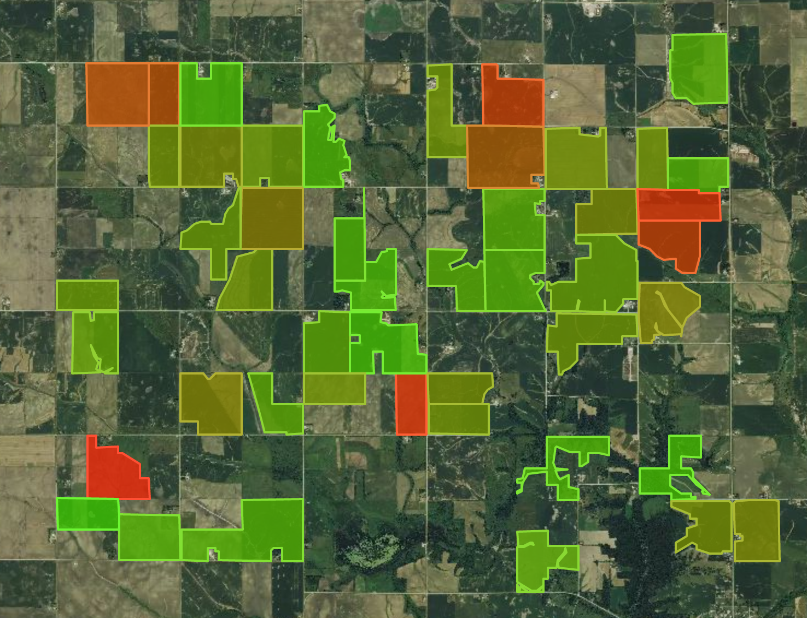

# Symbolized Astro Digital NDVI Vector Map

### [Working Example](https://rawgit.com/AstroDigital/example-ndvi-vector-symbology/master/example/index.html) | [Primary Code](https://github.com/AstroDigital/example-ndvi-vector-symbology/blob/master/example/ad-symbolized-map.js)

[](https://rawgit.com/AstroDigital/example-ndvi-vector-symbology/master/example/index.html)

## Overview
This tutorial describes extracting vector data from the return of [Astro Digital's NDVI values API](https://docs.astrodigital.com/docs/results), and using it with the Leaflet Javascript framework to render a symbolized map representing NDVI intensity. Be sure to check out the [Basic Astro Digital NDVI vector map setup](https://github.com/AstroDigital/example-ndvi-vector) tutorial, which describes the basics of map initialization in more detail. Other topics in this series include:
- [Using the vector and imagery NDVI products to create masked imagery](https://github.com/AstroDigital/example-field-mask) and
- [Graphing the NDVI values using Chart.js, and including precipitation as a secondary datasource](https://github.com/AstroDigital/example-ndvi-chart-plus).

## Summary

Begin by creating a FeatureCollection from the `results` attribute of [Astro Digital's NDVI values API response](https://docs.astrodigital.com/docs/results), as described in the [basic tutorial](https://github.com/AstroDigital/example-ndvi-vector). This time, we will include a call to Leaflet's `onEachFeature` method in the the construction of the vector feature, which will allow us to evaluate the values of each polygon and apply a legend accordingly. Because the example data contains NDVI values for a range of dates, we will also need to pick a specific date to symbolize by referencing its index.
```js
// Choose date index to use.
const dateIndex = 27;
let fieldPolys = L.geoJson({
  'type': 'FeatureCollection',
  'features': adNdviData.results.map((field) => {
    const id = field.id;
    field = field.value;
    field.properties.id = id;
    return field;
  })
}, {
  // This function is the only new item not in the introductory tutorial
  onEachFeature: setupLegend
});
```
The `setupLegend` function called by `onEachFeature` will be written to map the NDVI values of each feature in the collection to the colors defined in our external legend file, as shown below:
```js
const setupLegend = (feature, layer) => {
  // The NDVI values are represented on a scale of 0-1 while the legend we
  // have developed for this example contains 255 whole-number values. To compare
  // them, we will need to multiply each feature's NDVI value by 255.
  const ndviVal = Math.floor(
    feature.properties.ndvi_values[dateIndex].value * 255);
  // Find the RGB legend properties which match the active field's NDVI value, and
  // map them to variables called r, g, and b.
  const [r, g, b] = adNdviSymbology[ndviVal];
  // Define a symbol definition object in Leaflet syntax, where the polygon's
  // fill matches the RGB values listed in the legend file, and its outline
  // (color) attribute's RGB values are boosted slightly higher to add contrast.
  const symbology = {
    color: `rgb(${r + 50},${g + 50},${b + 50})`,
    weight: 2,
    opacity: 1,
    fillOpacity: 0.8,
    fillColor: `rgb(${r},${g},${b})`
  };
  // Apply the symbol definition to each feature.
  layer.setStyle(symbology);
};
```

With the features now appropriately symbolized, we are able to initialize the map using the same code as described in the [basic tutorial](https://github.com/AstroDigital/example-ndvi-vector).

Check out [the source code for more details!](example/ad-symbolized-map.js)

### Legend Definition

There are several ways a legend could be generated, including creating a function for dynamic gradient generation or logic to assign a more limited palette of colors based on binning of the NDVI values. In this example, we will define a legend in an [external file](https://github.com/AstroDigital/example-ndvi-vector-symbology/blob/master/example/ad-symbology.js), where intensity categories numbering 0 to 256 are associated with red, green, and blue values in a Javascript object. In addition to importing the NDVI values external data, we will also import the NDVI values response. The example program itself is located in the [ad-symbolized-map.js](https://github.com/AstroDigital/example-ndvi-vector-symbology/blob/master/example/ad-symbolized-map.js) file.
